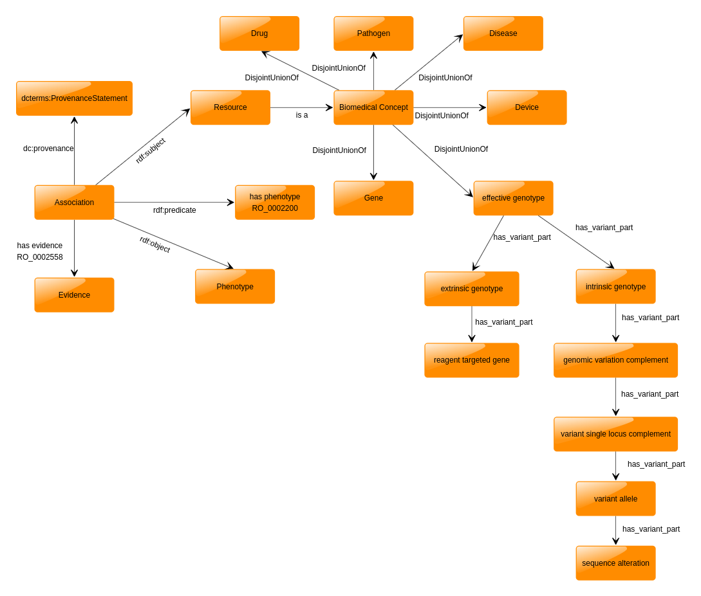

# Phenotype Reactor

The Phenotype Reactor is a platform that aggregate phenotype connections with different biomedical concepts and provides ability to compute phentypic similarity between these concepts. It also provides SPARQL endpoint and a query editor for querying the phenotypes relations knowledge base. The aggregated knowledge base covers diverse categories of biomedical concepts including but not limited to phentype relations with genes, genotype, disease, drug, pathogens and metabolites.

We have integrated phenotype relations from various sources including research studies and community resources such as [HPO phenotype annontations](https://hpo.jax.org/app/download/annotation).

## Data Model

Phenotype Reactor data model is a common structure for capturing phenotype associations so that discovered phenotype relations from various sources can be aggregated into a single common structure.

## Sources
The datasets aggregated from research studies and cummunity resources are follwoing:

- Phenotypye Annontations from HPO. [Link](https://hpo.jax.org/app/download/annotation)
- Ontology based text mining of gene-phenotype associations. [Link](https://www.ncbi.nlm.nih.gov/pubmed/30809638)
- Ontology based text mining of disease-phenotype associations. [Link](https://www.ncbi.nlm.nih.gov/pubmed/30809638)
- Ontology based text mining of disease classes in Mondo Disease ontology to phenotype associations. [Link](https://www.ncbi.nlm.nih.gov/pubmed/30809638)
- Ontology based text mining of metabolites-phenotype associations. [Link](https://www.ncbi.nlm.nih.gov/pubmed/30809638)
- Drug-phentype association based on drug side effect resource. [Link](https://www.ncbi.nlm.nih.gov/pubmed/20087340)
- PathoPhenoDB, linking human pathogens to their phenotypes in support of infectious disease research. [Link](https://www.nature.com/articles/s41597-019-0090-x)
- DeepPheno: Predicting single gene loss-of-function phenotypes using an ontology-aware hierarchical classifier. [Link](https://www.biorxiv.org/content/10.1101/839332v2)
